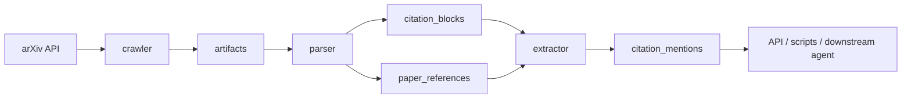
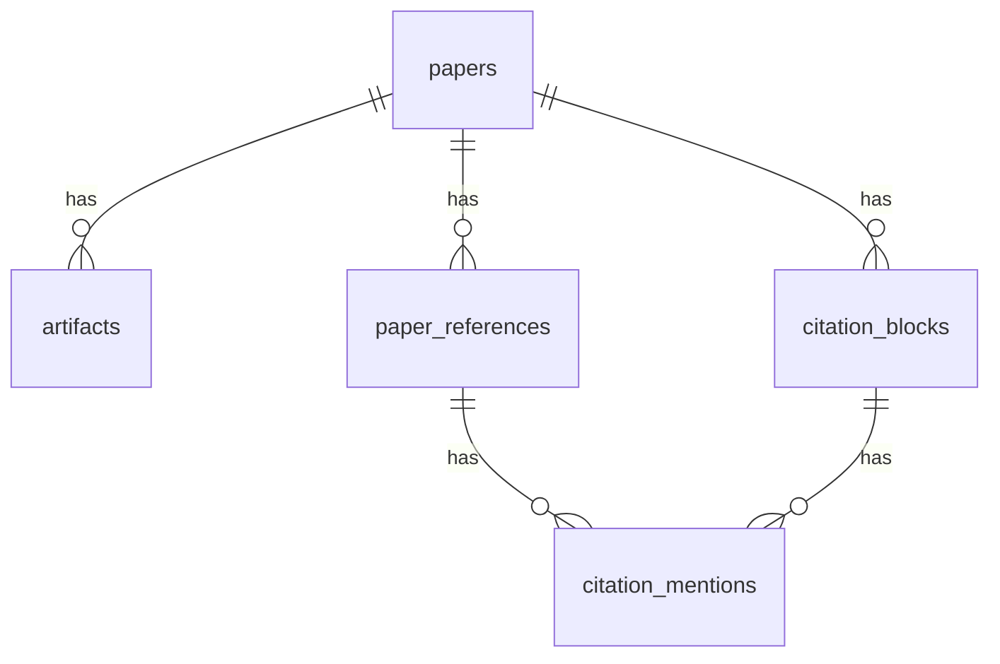

# ARCHITECTURE.md

## Purpose

This document describes the current architecture of the repository, the intended module boundaries, and the main design pressures behind the system.

It should help with two things:

- understanding how the current implementation is organized
- reviewing the architecture and identifying improvement directions

This is a pre-release system. Architectural cleanup and breaking refactors are acceptable when they improve the long-term foundation.

## System Goal

The system is a paper and citation knowledge base for scientific research workflows.

Current responsibility:

- ingest papers and raw artifacts
- parse source or PDF artifacts into structured records
- detect citation-bearing blocks
- extract citation mentions and citation semantics with LLMs
- store everything in an inspectable relational database

Future responsibility:

- serve as the substrate for a scientific deep research agent
- support retrieval, evidence tracing, citation-grounded synthesis, and agentic research workflows

## Architecture Summary

The system currently follows a modular pipeline:



Core runtime layers:

- API layer: FastAPI routes in `main.py`
- service layer: crawler, parser, extractor, orchestrator, plus shared job/result helpers
- persistence layer: SQLAlchemy models and SQLite or other SQLAlchemy-supported databases
- provider layer: Gemini client and centralized prompt templates
- tooling layer: inspection scripts, demo runner, and pipeline runner

## Repository Structure

Current important files and directories:

- `src/briefgpt_arxiv/main.py`
  - FastAPI entrypoint
- `src/briefgpt_arxiv/db.py`
  - SQLAlchemy engine, session factory, runtime schema creation, and lightweight migration logic
- `src/briefgpt_arxiv/models.py`
  - ORM models and current relational schema
- `src/briefgpt_arxiv/services/crawler.py`
  - arXiv metadata and artifact ingestion
- `src/briefgpt_arxiv/services/parser.py`
  - structured parse ingestion, source parsing, PDF parsing, citation block detection
- `src/briefgpt_arxiv/services/extractor.py`
  - LLM-backed extraction of citation mentions and semantics
- `src/briefgpt_arxiv/services/orchestrator.py`
  - pipeline sequencing across crawl, parse, and extract
- `src/briefgpt_arxiv/services/contracts.py`
  - structured service result objects for parse, extract, and pipeline runs
- `src/briefgpt_arxiv/services/jobs.py`
  - shared ingestion job lifecycle helper
- `src/briefgpt_arxiv/gemini.py`
  - Gemini provider client
- `src/briefgpt_arxiv/prompts.py`
  - centralized prompt templates and JSON schemas
- `scripts/inspect_db.py`
  - local inspection tooling for schema, data, and jobs
- `scripts/run_pipeline.py`
  - operational pipeline runner with explicit rerun controls and `crawl`/`local-artifacts` modes
- `scripts/run_demo.sh`
  - local demo wrapper around either crawl mode or the checked-in artifact flow
- `tests/`
  - module and API tests

## Runtime Construction

The application is currently initialized like this:

1. `main.py` creates the FastAPI app
2. `init_db()` is called at import time
3. `init_db()` creates tables for the current schema and applies lightweight migration logic
4. route handlers create a database session through dependency injection
5. route handlers call service objects
6. services read and write ORM models directly

This keeps startup simple, but it has tradeoffs:

- easy local startup
- low ceremony
- hidden initialization work at import time
- tighter coupling between DB initialization and API startup than we would want long term

## Module Boundaries

### `crawler`

Responsibility:

- fetch arXiv metadata
- derive canonical arXiv id and version
- download raw artifacts such as PDF and source tar
- persist artifact metadata and crawl jobs

Inputs:

- arXiv ids

Outputs:

- `papers`
- `artifacts`
- `ingestion_jobs` for crawl activity

Design rules:

- crawler should not parse document structure
- crawler should not perform citation semantics extraction

Implementation notes:

- `CrawlerService` uses `JobTracker` to create start and completion or failure records
- current crawl API still returns simple ORM-derived response items rather than structured service contracts

### `parser`

Responsibility:

- select the best available parse path
- consume structured parse inputs if available
- parse source artifacts when viable
- parse PDF text directly when necessary
- emit section records, reference records, and citation-bearing blocks
- optionally use an LLM repair step for malformed or unusual citation structures

Inputs:

- `structured_parse` artifact
- or `source` artifact
- or `pdf_text` artifact
- or raw `pdf` artifact

Outputs:

- `paper_references`
- `citation_blocks`
- `ingestion_jobs` for parse activity
- `pdf_text` artifact when direct PDF extraction is used

Design rules:

- parser produces structural facts
- parser does not produce final citation semantics

Current implementation details:

- `ParserService.parse_paper()` returns a `ParseRunResult` contract with source artifact details, created counts, cleanup information, and status
- explicit rerun behavior exists:
  - `rerun=True` clears old parse outputs before rebuilding them
  - `rerun=False` records a skipped parse job when outputs already exist
- explicit cleanup exists through `clear_parse_outputs()`

PDF-first behavior:

- PDF text parsing now reconstructs paragraphs rather than treating every line as an independent unit
- PDF reference parsing supports multiline reference entries
- citation extraction from PDF text supports bracket citations like `[4, 5]` and citation ranges like `[1-3]`
- parser filters common PDF noise such as page numbers, `arXiv:` lines, and repeated technical-report headers
- section heading detection prefers numbered headings and avoids many table-number false positives

Known PDF limitations:

- table-heavy pages can still leak into citation-bearing blocks
- some merged headings and broken spacing from extracted PDF text still survive into stored block text
- reference title extraction is heuristic and still imperfect for noisy bibliography lines

### `extractor`

Responsibility:

- read citation blocks and local reference mappings
- call the extraction LLM
- convert citation blocks into structured citation mentions
- store semantic outputs directly on the mention rows

Inputs:

- `citation_blocks`
- `paper_references`

Outputs:

- `citation_mentions`
- `ingestion_jobs` for extraction activity

Design rules:

- extractor should not guess references outside parser-provided mappings
- extractor should not re-parse the document globally

Current implementation details:

- `ExtractorService.extract_for_paper_result()` returns an `ExtractionRunResult` contract with counts, cleanup information, status, and model name
- `extract_for_paper()` still returns the legacy tuple for compatibility with the current API layer
- explicit rerun behavior exists:
  - `rerun=True` clears old mention outputs before rebuilding them
  - `rerun=False` records a skipped extract job when outputs already exist
- explicit cleanup exists through `clear_extractions()`
- the default extractor requires `GEMINI_API_KEY`; extraction is intentionally disabled without an LLM client

### `orchestrator`

Responsibility:

- sequence `crawler -> parser -> extractor`
- provide one-call execution for one or more papers

Current implementation details:

- `run_for_arxiv_ids()` preserves the old list-of-paper-id return shape
- `run_pipeline_for_arxiv_ids()` returns structured `PipelineRunResult` contracts
- the orchestrator now supports separate rerun control for parse and extract stages

This means the orchestrator is no longer only conceptual; it is now a practical service boundary used by tooling.

## Data Model

The runtime model is paper-centric.



Key tables:

- `papers`
  - one row per ingested paper
  - stores metadata and high-level pipeline state
- `artifacts`
  - raw or derived files such as `pdf`, `source`, `pdf_text`, `structured_parse`
- `paper_references`
  - local reference list extracted from the paper
- `citation_blocks`
  - parsed text chunks with section metadata; citation-bearing rows drive extraction
- `citation_mentions`
  - mention-level semantics, including model outputs and grounded summaries
- `ingestion_jobs`
  - stage-oriented execution tracking with attempts and timestamps

Schema principles:

- treat the database as the source of truth for pipeline state
- prefer the fewest persisted layers that still support inspection, reruns, and downstream consumption
- avoid separate tables that only mirror pipeline stages without independent value
- avoid duplicated text storage across adjacent layers unless it materially improves debugging or prevents repeated expensive work
- keep operationally useful fields in first-class columns instead of burying core state in JSON

Important current characteristics:

- citation semantics live directly on `citation_mentions`
- there is no separate canonical `references` layer in the active runtime schema
- there is no active `paper_versions` runtime dependency in the current model
- service-layer contracts are structured in Python dataclasses, but those contracts are not themselves persisted

## Pipeline State and Job Tracking

Top-level paper state lives on the `papers` row:

- `discovered`
- `fetched`
- `parsed`
- `ready`

Additional top-level state:

- `parse_status`
- `parsed_at`

Stage-specific execution history lives in `ingestion_jobs`:

- `crawl`
- `parse`
- `extract`

Current job tracking characteristics:

- every service stage creates an explicit start record
- completion and failure records carry `finished_at`
- repeated runs increment `attempt_count` per `(job_type, target_id)`
- skipped reruns are recorded as job rows with `status="skipped"`

This is still lightweight rather than a full workflow event log, but it is materially more useful than the earlier fire-and-forget model.

## Service Contracts and Compatibility Layer

The repository now has two service-interface styles living side by side:

- structured result-returning parser methods
- legacy tuple-returning extractor methods
- structured result-returning methods used by scripts and internal orchestration

Examples:

- `ParserService.parse_paper()` -> `ParseRunResult`
- `ExtractorService.extract_for_paper()` -> tuple
- `ExtractorService.extract_for_paper_result()` -> `ExtractionRunResult`
- `OrchestratorService.run_for_arxiv_ids()` -> `list[int]`
- `OrchestratorService.run_pipeline_for_arxiv_ids()` -> `list[PipelineRunResult]`

This is transitional. The parser has already moved to the structured contract, while the extractor and some outward-facing surfaces still preserve older return shapes.

## LLM Architecture

LLM behavior is centralized in two places:

- provider client: `gemini.py`
- prompts and schemas: `prompts.py`

Current LLM usage:

- parser repair for malformed citation-bearing text
- extractor semantics for citation mentions
- legacy utility scripts for reference summarization and QA

Design intent:

- provider logic should stay centralized
- prompt templates should stay centralized
- structured output should be schema-constrained

This remains a strong architectural decision and should be preserved.

## API Surface

Current API responsibilities:

- trigger crawl
- trigger parse
- trigger extraction
- fetch one paper
- fetch a paper's references and extracted mentions
- search extracted citations

The API is intentionally thin and delegates logic to services.

Current limitation:

- the public API still exposes mostly persistence-shaped responses
- extraction still preserves a tuple-returning compatibility method even though parser no longer does

Desired direction:

- route handlers should stay orchestration-thin
- services should hold business logic
- external response schemas should become more deliberately separated from persistence-oriented service outputs over time

## Inspection and Tooling

The repository treats inspectability as a first-class concern.

Current important tooling:

- `scripts/inspect_db.py`
  - inspect papers, references, mentions, blocks, jobs, raw SQL, and schema dumps
- `scripts/run_pipeline.py`
  - network-backed operational runner with explicit rerun controls
- `scripts/run_demo.sh`
  - wrapper for the checked-in local demo flow
- `parser/demo.py`
  - artifact-seeded local parse and extract workflow

This is important to preserve because the knowledge base will only be trustworthy if:

- pipeline state is easy to inspect
- intermediate outputs are easy to view
- failures are easy to diagnose
- reruns are explicit rather than implicit

## Dependency Rules

Preferred dependency direction:

```text
main/api
  -> services
    -> models/db
    -> provider clients
    -> prompt templates
    -> utils
```

Allowed current additions inside the service layer:

- `services/contracts.py`
- `services/jobs.py`

Rules:

- `main.py` should not own business logic
- services may depend on ORM models, config, providers, prompts, utils, and shared service helper modules
- providers should not depend on services
- prompt definitions should not depend on services
- scripts may depend on public service interfaces and ORM models, but should not become the place where core workflow logic lives

## Current Strengths

- clear pipeline decomposition into crawler, parser, extractor, and orchestrator
- centralized prompt and provider layers
- inspectable relational data model
- explicit rerun and cleanup semantics in parser and extractor services
- lightweight but useful job tracking with attempts and finish timestamps
- operational tooling for both local demo and network-backed pipeline runs
- improved PDF-first parsing compared with the earlier line-oriented fallback
- test coverage around crawl, parse, extract, prompts, and API flows

## Current Weak Spots

### 1. Startup-time schema initialization is still coupled to app import

`init_db()` still runs at import time in `main.py`.

This is convenient for local work, but not ideal long term.

Likely future improvement:

- move schema creation and migration into explicit tooling
- keep API startup focused on runtime construction

### 2. The API boundary still mirrors internal storage more than service intent

The service layer now has structured result contracts, but the public API still exposes a simpler persistence-shaped contract.

Likely future improvement:

- introduce a clearer application or service-contract layer for outward-facing workflow endpoints
- separate storage-oriented and external-response schemas more deliberately

### 3. PDF-first parsing is better, but still heuristic

The parser now reconstructs paragraphs, expands citation ranges, and groups multiline references, but it is still fundamentally working from noisy extracted text.

Likely future improvement:

- improve section and subsection recovery
- detect and filter table-heavy blocks more aggressively
- improve reference title extraction and author or venue recovery
- better distinguish narrative citation blocks from benchmark tables and captions

### 4. SQLite remains convenient but easy to lock under concurrent workflows

The repository still defaults to SQLite.

Likely future improvement:

- improve session discipline further in tests and tooling
- reduce concurrent interactive access to the same local file
- consider PostgreSQL for heavier concurrent development and production use

## Suggested Improvement Directions

These are the most natural next architectural upgrades from the current state.

### Direction A: stabilize the domain model

- keep the runtime model firmly paper-centric unless a real product need reintroduces first-class version entities
- make the schema story easier to explain in one pass

Status:

- mostly on track
- current runtime schema is simpler and clearer than earlier designs

### Direction B: formalize parse artifacts

- define a stronger internal parse contract
- make parser outputs more reusable across downstream consumers
- separate conceptual stages more clearly in code and interfaces without adding persisted layers unless they provide independent value

Status:

- partially implemented
- `ParseRunResult` now formalizes stage outcomes, but parser outputs are still persisted only through ORM tables rather than a reusable in-memory parse artifact object shared across more consumers

### Direction C: harden PDF-first operation

- improve PDF section detection
- improve reference extraction quality
- improve citation block segmentation
- treat source parsing as an optimization, not an assumption

Status:

- materially improved
- still the most important quality frontier in the parser

### Direction D: improve operational workflow

- add a stable pipeline runner script or CLI
- add explicit cleanup and rerun semantics
- improve job tracking and failure introspection

Status:

- largely implemented
- `scripts/run_pipeline.py`, `scripts/run_demo.sh`, `JobTracker`, rerun flags, cleanup methods, and `inspect_db.py jobs` now exist

### Direction E: prepare for the future research agent layer

- make retrieval-oriented outputs easier to consume
- preserve provenance and evidence links
- keep extraction outputs grounded and inspectable
- avoid product-specific abstractions that would make future agent composition harder

Status:

- partially implemented
- provenance is reasonably inspectable through blocks, mentions, and references, but retrieval-specific interfaces are still thin

## Review Questions

When reviewing this architecture, useful questions are:

- Is paper-centric storage still the right long-term domain shape?
- Should versioning return as a first-class runtime concept?
- Is parser output granular enough for future retrieval and evidence-tracing use cases?
- Is citation extraction stored at the right level of abstraction?
- Should job tracking remain lightweight or become a fuller workflow or event model?
- Should the outward API adopt the structured service contracts now present internally?
- What is the right long-term balance between source parsing and PDF parsing?
- How much PDF noise filtering belongs inside the parser versus downstream quality-control tooling?

## Bottom Line

The current architecture is stronger than the original MVP shape.

Its strongest properties are:

- it behaves like inspectable infrastructure rather than a throwaway demo
- it now has explicit operational semantics for reruns, cleanup, and job tracing
- it has a clearer internal service-contract story than the public API currently exposes

Its main next step is not simply adding more surface area. The highest-value work now is continuing to harden PDF-first parsing quality and deciding how much of the newer internal service-contract layer should become part of the outward-facing application boundary.
