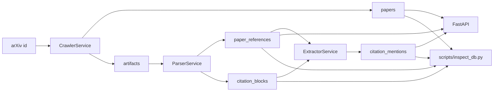
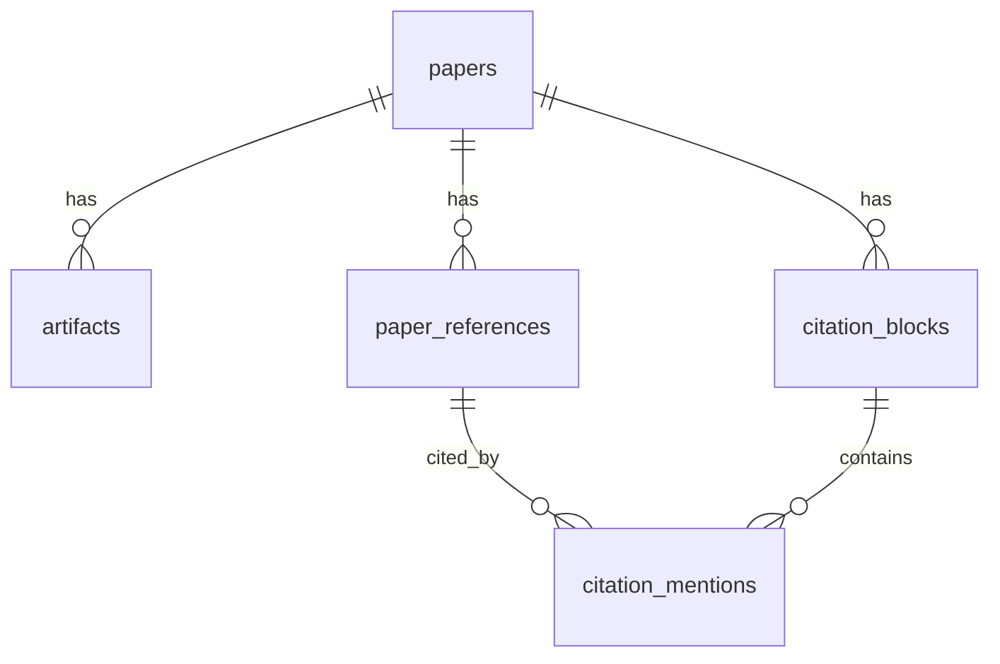

# ARCHITECTURE.md

## Purpose

This repository implements the knowledge-base layer for a future scientific deep research agent.

Today it focuses on one concrete job:

- ingest an arXiv paper
- persist its raw artifacts
- parse references and citation-bearing text blocks
- extract citation-level semantics with an LLM
- expose the resulting state through a database, scripts, and a thin API

The architecture is intentionally paper-centric, database-backed, and rerunnable.

## System Overview

The core pipeline is:



The pipeline is staged on purpose.

Each stage writes durable state before the next stage begins:

- crawl writes `papers` and `artifacts`
- parse writes `paper_references` and `citation_blocks`
- extract writes `citation_mentions`

This makes the system easier to inspect, rerun, and debug than an in-memory end-to-end flow.

## Repository Structure

Key paths:

- `src/briefgpt_arxiv/main.py`: FastAPI entrypoint
- `src/briefgpt_arxiv/config.py`: environment and YAML-backed settings
- `src/briefgpt_arxiv/db.py`: SQLAlchemy engine, session factory, and table initialization
- `src/briefgpt_arxiv/models.py`: ORM schema
- `src/briefgpt_arxiv/schemas.py`: API response models
- `src/briefgpt_arxiv/llm_client.py`: Gemini and OpenAI-compatible client implementations
- `src/briefgpt_arxiv/prompts.py`: prompt templates
- `src/briefgpt_arxiv/services/crawler.py`: arXiv metadata and artifact ingestion
- `src/briefgpt_arxiv/services/parser.py`: source / structured parse / PDF parsing
- `src/briefgpt_arxiv/services/extractor.py`: citation candidate generation and LLM-backed extraction
- `src/briefgpt_arxiv/services/orchestrator.py`: full pipeline composition
- `src/briefgpt_arxiv/services/jobs.py`: pipeline job tracking
- `src/briefgpt_arxiv/services/contracts.py`: structured stage result objects
- `scripts/run_pipeline.py`: pipeline runner
- `scripts/inspect_db.py`: database inspection utility

## Runtime Layers

### API layer

`main.py` is intentionally thin.

It:

- creates the FastAPI app
- initializes tables with `init_db()`
- exposes workflow endpoints for crawl, parse, and extract
- exposes read endpoints for papers, references, and citation search
- delegates real work to services

The API should not contain parsing or extraction logic.

### Service layer

`services/` contains the business logic.

The main services are:

- `CrawlerService`: fetch metadata and persist artifacts
- `ParserService`: choose the best available input and derive references plus citation blocks
- `ExtractorService`: build citation candidates and ask the LLM for mention semantics
- `OrchestratorService`: run crawl -> parse -> extract for one or more papers
- `JobTracker`: persist execution history

This is the main center of the system.

### Persistence layer

`db.py` and `models.py` define durable pipeline state.

Important properties:

- SQLite is the default backing store
- the same database is used by the API and scripts
- rows represent real pipeline boundaries, not just cache
- reruns overwrite stage outputs instead of layering ephemeral state on top

### LLM layer

`llm_client.py` and `prompts.py` isolate model-provider behavior from pipeline orchestration.

That layer is responsible for:

- provider-specific HTTP payloads
- retry behavior
- response text extraction
- JSON parsing
- prompt construction

Parser and extractor should describe the task they need solved, not how to talk to a vendor API.

## Data Model

The database schema is paper-centric.



### papers

One row per arXiv paper version.

Important fields:

- `arxiv_id`
- `version`
- `title`
- `abstract`
- `primary_category`
- `ingest_status`
- `parse_status`
- `parsed_at`

This is the root row for the rest of the pipeline.

### artifacts

Files associated with a paper.

Typical artifact types:

- `pdf`
- `source`
- `pdf_text`
- `structured_parse`

Artifacts may be downloaded or derived.

### paper_references

The paper-local bibliography extracted from the chosen input artifact.

Important fields:

- `local_ref_id`
- `title`
- `authors_json`
- `year`
- `venue`
- `cited_arxiv_id`
- `cited_version`

The system treats references as scoped to the source paper.

### citation_blocks

Parsed text chunks produced by the parser.

Important fields:

- `section_title`
- `section_path`
- `chunk_index`
- `raw_text`
- `raw_citation_keys`
- `has_citations`
- `repair_used`

The parser writes all sections it decides to keep, then marks which ones actually contain citations.

### citation_mentions

Mention-level extraction output.

Important fields:

- `citation_block_id`
- `paper_reference_id`
- `citation_mention`
- `sentence_text`
- `mention_order`
- `model`
- `prompt_version`
- `intent_label`
- `summary`
- `json_result`
- `status`

This is the main downstream retrieval surface for citation-aware search and future research-agent use.

### ingestion_jobs

Execution history for crawl, parse, and extract.

Important fields:

- `job_type`
- `target_id`
- `status`
- `attempt_count`
- `error_message`
- `started_at`
- `finished_at`

Jobs are part of the architecture, not logging trivia. They make reruns inspectable.

## Pipeline Stages

### Crawl

`CrawlerService` does three things:

1. query arXiv metadata
2. upsert the corresponding `papers` row
3. download and persist raw artifacts

The crawler writes artifact files under `ARTIFACT_ROOT/<arxiv_id>/<version>/`.

It currently stores:

- the PDF
- the source bundle

### Parse

`ParserService` converts one available artifact into references plus citation blocks.

Input priority is:

1. `structured_parse`
2. `source`
3. `pdf_text`
4. `pdf`

This priority reflects trust in the inputs:

- structured parse is the richest and most explicit
- source is preferable to PDF when available
- PDF text is a fallback
- raw PDF is the last resort and is first converted into `pdf_text`

#### Structured parse path

The parser expects a top-level `latex_parse` object with:

- `bib_entries`
- `body_text`

This path is treated as already structured.
It does not route the text through repair logic.

#### Source path

The source parser:

- strips LaTeX comments before extraction
- extracts bibliography data from `thebibliography`, `.bbl`, and `.bib`
- splits text into section-like fragments
- detects citation-bearing paragraphs
- uses the repair client only when the paragraph shows non-standard citation macros

This keeps normal LaTeX `\cite{...}` handling direct while still allowing an LLM-backed repair step for unusual source forms.

#### PDF path

The PDF path is intentionally heuristic.

It:

- extracts plain text from the PDF when needed
- reconstructs paragraphs
- recognizes numbered references like `[12]`
- derives `REF<n>` local keys
- extracts rough reference titles and years

The PDF parser is a fallback path, not the preferred canonical parse.

### Extract

`ExtractorService` operates on parsed citation blocks and the paper-local reference map.

Its flow is:

1. load citation-bearing blocks
2. load paper-local references
3. build deterministic citation candidates
4. render the extraction prompt
5. require one structured JSON response shape: `{"items": [...]}`
6. persist one `citation_mentions` row per extracted citation mention

Important design choices:

- unknown citation keys are skipped rather than guessed
- candidate generation is deterministic and separate from the LLM
- the LLM only annotates semantics, it does not decide which citations exist
- extraction outputs are normalized before persistence

## LLM Architecture

`llm_client.py` currently supports two providers:

- `GeminiAPIClient`
- `OpenAICompatibleClient`

The interface is intentionally small:

- `generate_json(system_instruction, user_text)`
- `generate_text(system_instruction, user_text)`

The OpenAI-compatible path is used for both DeepSeek and OpenRouter-hosted OpenAI models.
Its request format is unified around OpenRouter chat-completions with content-part messages.

The client layer owns:

- transport retries
- body-level retry handling for retryable provider errors
- provider-specific response parsing
- JSON extraction from model text responses

Prompt templates live in `prompts.py`.

The prompts intentionally:

- describe required JSON fields explicitly
- avoid embedding large JSON schemas in the prompt
- keep provider behavior out of service logic

## Orchestration and Reruns

`OrchestratorService` is intentionally thin.

It exists to compose:

- crawler
- parser
- extractor

Stage services remain independently runnable.

Rerun behavior is explicit:

- parse can reuse existing parse outputs or rebuild them
- extract can reuse existing mentions or rebuild them
- rebuilding a stage clears that stage's persisted outputs first

This keeps state transitions understandable and reduces accidental duplication.

## API and Script Surface

### API

Current API endpoints:

- `POST /crawl/arxiv`
- `POST /parse/{paper_id}`
- `POST /extract/{paper_id}`
- `GET /papers/{arxiv_id}`
- `GET /papers/{arxiv_id}/references`
- `GET /citations/search`

The API is for operation and inspection, not for embedding business logic.

### Scripts

Operational scripts mirror the same service layer:

- `scripts/run_pipeline.py`: full pipeline runner
- `scripts/run_demo.sh`: local demo wrapper
- `scripts/inspect_db.py`: inspection and ad hoc SQL utility

There is no separate script-only architecture.
Scripts and API call the same services against the same schema.

## Dependency Direction

The intended dependency direction is:

```text
API / scripts
    -> services
        -> models / db
        -> llm_client / prompts
        -> utils / config
```

Important constraints:

- services may depend on ORM models and LLM clients
- prompts should not depend on services
- API handlers should not own pipeline logic
- database rows should be the system of record for pipeline state

## Design Principles

The current architecture follows these working rules:

- prefer persisted stage boundaries over hidden in-memory flows
- prefer deterministic parsing and candidate generation over LLM guesswork
- keep provider-specific behavior in the client layer
- use LLMs for narrow semantic extraction, not for broad orchestration
- allow breaking changes when they improve correctness and clarity
- remove obsolete compatibility logic rather than preserving it indefinitely

This repository is still pre-release.
The goal is not maximum flexibility.
The goal is a clean, robust, inspectable ingestion and citation knowledge base.
