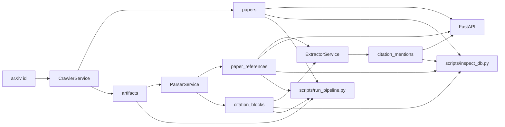
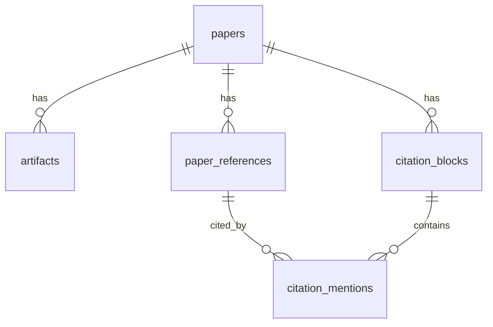

# Architecture

## Purpose

This repository implements the citation knowledge-base layer for a future scientific research system.
Its job today is narrower and concrete:

- ingest arXiv papers
- persist raw and derived artifacts
- parse references and citation-bearing text
- run LLM-backed citation summarization
- expose durable state through an API, scripts, and a local database

The architecture is intentionally database-backed, stage-oriented, and rerunnable.

## System overview



The important property is not just the order of stages, but the persistence boundary between them:

- crawl writes `papers` and `artifacts`
- parse writes `paper_references` and `citation_blocks`
- extract writes `citation_mentions`

That boundary gives the project three practical advantages:

- intermediate outputs are inspectable
- reruns can be scoped to one stage
- failures do not force a full restart of the pipeline

## Repository structure

Core runtime paths:

- `src/briefgpt_arxiv/main.py`: FastAPI application and HTTP endpoints
- `src/briefgpt_arxiv/config.py`: environment and `config.yaml` loading
- `src/briefgpt_arxiv/db.py`: engine, session factory, table initialization
- `src/briefgpt_arxiv/models.py`: SQLAlchemy ORM schema
- `src/briefgpt_arxiv/schemas.py`: API response models
- `src/briefgpt_arxiv/llm_client.py`: provider-specific LLM clients
- `src/briefgpt_arxiv/prompts.py`: prompt templates
- `src/briefgpt_arxiv/services/crawler.py`: arXiv ingestion
- `src/briefgpt_arxiv/services/parser.py`: parse input selection and parsing logic
- `src/briefgpt_arxiv/services/extractor.py`: citation candidate generation and extraction
- `src/briefgpt_arxiv/services/orchestrator.py`: crawl -> parse -> extract composition
- `src/briefgpt_arxiv/services/jobs.py`: job lifecycle tracking
- `src/briefgpt_arxiv/services/contracts.py`: structured stage result types
- `scripts/run_pipeline.py`: CLI runner for the end-to-end pipeline
- `scripts/run_extractor.py`: CLI runner for extractor-only reruns
- `scripts/inspect_db.py`: local inspection and ad hoc SQL utility
- `src/evaluation/summary_eval.py`: summary evaluation logic

## Runtime layers

### API layer

`main.py` is intentionally thin.
It is responsible for:

- creating the FastAPI app
- initializing the database
- exposing crawl, parse, extract, and read endpoints
- translating service failures into HTTP responses

It is not the place for parsing heuristics, extraction logic, or provider-specific LLM handling.

### Service layer

The service layer is the center of the system.

Main services:

- `CrawlerService`: fetch arXiv metadata and artifacts
- `ParserService`: choose the best available input and produce references plus citation blocks
- `ExtractorService`: generate deterministic citation candidates and request semantic annotations
- `OrchestratorService`: compose the full pipeline for one or more papers
- `JobTracker`: persist stage execution history

The services own pipeline behavior; the API and scripts just call them.

### Persistence layer

`db.py` and `models.py` define the durable state of the pipeline.

Design properties:

- SQLite is the default store, but the app is written through SQLAlchemy
- the same database is shared by API handlers and local scripts
- rows are stage outputs, not disposable cache
- reruns clear and rebuild stage outputs when requested

### LLM layer

`llm_client.py` and `prompts.py` isolate provider details from pipeline orchestration.

This layer owns:

- transport and retry behavior
- provider-specific request and response parsing
- JSON extraction from model output
- prompt rendering for parser repair and citation extraction

The rest of the system asks for a task to be solved, not for a vendor API payload to be built.

## Data model



### `papers`

One row per arXiv paper version.

Important fields:

- `arxiv_id`
- `version`
- `title`
- `abstract`
- `primary_category`
- `ingest_status`
- `parse_status`
- `parsed_at`

This is the root entity for the rest of the pipeline.

### `artifacts`

Files associated with a paper.
They may be downloaded from arXiv or derived locally during parsing.

Typical `artifact_type` values:

- `pdf`
- `source`
- `pdf_text`
- `structured_parse`

### `paper_references`

The bibliography extracted from one paper.

Important fields:

- `local_ref_id`
- `title`
- `authors_json`
- `year`
- `venue`
- `cited_arxiv_id`
- `cited_version`

References are intentionally scoped to the source paper.
This project does not yet try to maintain a canonical global reference graph.

### `citation_blocks`

Text chunks that the parser keeps as extraction candidates.

Important fields:

- `section_title`
- `section_path`
- `chunk_index`
- `raw_text`
- `raw_citation_keys`
- `has_citations`
- `repair_used`

The parser may store more blocks than the extractor eventually uses. The extractor only processes citation-bearing blocks.

### `citation_mentions`

Mention-level citation extraction output.

Important fields:

- `citation_block_id`
- `paper_reference_id`
- `citation_mention`
- `sentence_text`
- `mention_order`
- `model`
- `prompt_version`
- `intent_label`
- `summary`
- `json_result`
- `status`

This is the main downstream retrieval surface for citation-aware search and future research workflows.

### `ingestion_jobs`

Execution history for crawl, parse, and extract.

Important fields:

- `job_type`
- `target_id`
- `status`
- `attempt_count`
- `error_message`
- `started_at`
- `finished_at`

Jobs are part of the core architecture because reruns and failures need to be inspectable.

## Pipeline stages

### 1. Crawl

`CrawlerService` is responsible for:

1. fetching arXiv metadata
2. upserting the `papers` row
3. downloading and registering raw artifacts

Artifacts are stored under:

```text
ARTIFACT_ROOT/<arxiv_id>/<version>/
```

At minimum, the crawler aims to persist the paper PDF and source bundle when available.

### 2. Parse

`ParserService` converts one selected artifact into references and citation blocks.

Input priority:

1. `structured_parse`
2. `source`
3. `pdf_text`
4. `pdf`

That order reflects confidence in the available structure.

#### Structured parse path

The structured parse path expects a top-level `latex_parse` object containing:

- `bib_entries`
- `body_text`

It treats the input as already structured and skips repair logic.

#### Source path

The source parser:

- strips LaTeX comments
- reads `.tex` directly or expands a source tarball
- extracts bibliography entries from `thebibliography`, `.bbl`, and `.bib`
- splits body text into section-like chunks
- extracts citation keys
- calls parser repair only when citation markup looks irregular

The repair step is optional and only activates when parser LLM credentials are present.

#### PDF text and PDF path

PDF parsing is the fallback path.
If only `pdf` exists, the parser first derives `pdf_text`, registers it as an artifact, and then parses the extracted text.

This path is heuristic by design:

- it reconstructs paragraphs from plain text
- it recognizes numbered references like `[12]`
- it synthesizes local reference ids such as `REF12`
- it extracts rough titles and years when possible

The PDF path is useful for coverage, but it is not the preferred canonical representation.

#### Parse reruns

When parse reruns with cleanup enabled:

- existing `citation_mentions` for the paper are deleted indirectly through block cleanup
- existing `citation_blocks` are deleted
- existing `paper_references` are deleted
- the paper state moves back to a parseable status before rebuilding

This keeps stage outputs internally consistent instead of layering new parse outputs on top of old ones.

### 3. Extract

`ExtractorService` works from parsed citation-bearing blocks and the paper-local reference map.

Its flow is:

1. load citation-bearing blocks
2. load references for the paper
3. build deterministic citation candidates from parser output
4. skip clearly tabular or non-narrative blocks
5. render the extraction prompt
6. require a strict JSON response shaped as `{"items": [...]}`
7. normalize and persist one `citation_mentions` row per candidate

Key design choices:

- unknown citation keys are skipped rather than guessed
- candidate generation is deterministic and separate from the LLM
- the LLM annotates meaning, not citation existence
- summaries are post-processed before persistence to reduce self-reference and benchmark overclaiming
- prompt inputs and outputs are logged to `SUMMARY_DEBUG_LOG_PATH`

#### Extract reruns

If extraction reruns on a paper that already has mentions:

- existing `citation_mentions` for that paper are cleared first
- the paper status drops from `ready` back to `parsed`
- fresh mentions are written in one new pass

This avoids duplicate mention rows and keeps extraction state easy to reason about.

## Orchestration and entrypoints

### API endpoints

Current API surface:

- `POST /crawl/arxiv`
- `POST /parse/{paper_id}`
- `POST /extract/{paper_id}`
- `GET /papers/{arxiv_id}`
- `GET /papers/{arxiv_id}/references`
- `GET /citations/search`

The API is operational and inspectable by design. It should stay thin.

### CLI scripts

Scripts mirror the same service layer instead of reimplementing pipeline logic:

- `scripts/run_pipeline.py`: run crawl, parse, and extract for one or more ids
- `scripts/run_extractor.py`: rerun extraction for an existing paper
- `scripts/run_demo.sh`: run a demo database workflow
- `scripts/inspect_db.py`: inspect database contents and job history
- `scripts/export_summary_eval_candidates.py`: export labeling candidates
- `scripts/run_summary_eval.py`: score summary predictions

There is no separate script-only architecture. Scripts and HTTP handlers use the same services and schema.

## Dependency direction

The intended dependency direction is:

```text
API / scripts
    -> services
        -> models / db
        -> llm_client / prompts
        -> utils / config
```

Constraints that matter:

- API handlers should not own pipeline logic
- prompts should not depend on services
- persistence models are the system of record
- LLM provider details should stay inside the client layer

## Failure handling and observability

The project favors explicit, inspectable failures over hidden retries and silent fallback.

Current observability surfaces:

- `ingestion_jobs` records stage lifecycle and errors
- stage outputs remain in the database for inspection
- extractor prompt/response traces are appended to `SUMMARY_DEBUG_LOG_PATH`
- `scripts/inspect_db.py` provides fast local visibility into papers, blocks, mentions, and jobs

## Design principles

The current architecture follows these rules:

- prefer persisted stage boundaries over in-memory chaining
- prefer deterministic parsing and candidate generation over LLM guesswork
- prefer thin entrypoints and thick services
- keep provider-specific behavior isolated
- use LLMs for narrow semantic work, not broad orchestration
- allow pre-release breaking changes when they improve correctness and clarity

The goal is not maximum generality yet.
The goal is a clean, robust, inspectable citation knowledge base that can support future research workflows.
