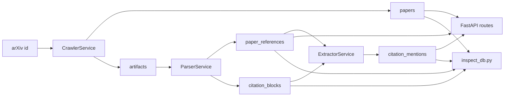
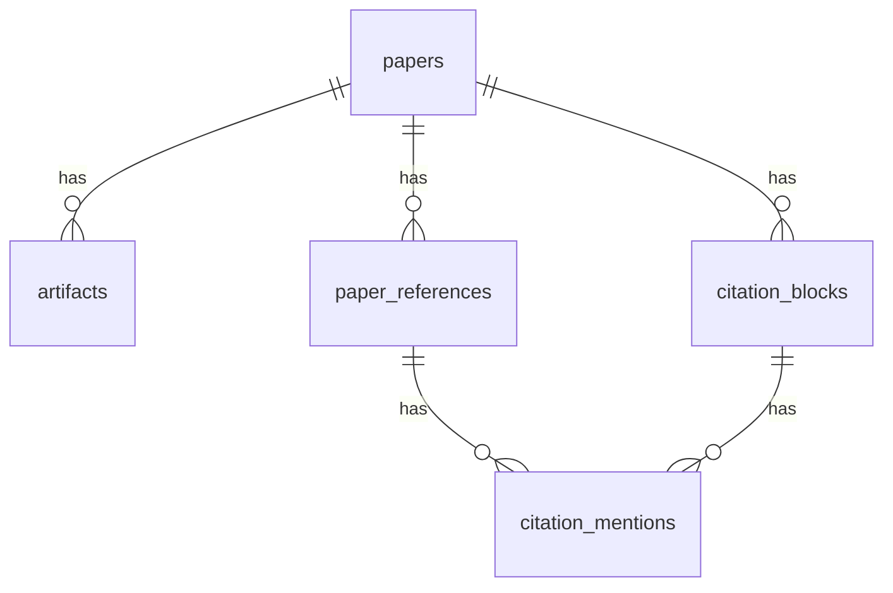

# ARCHITECTURE.md

## Purpose

This repository implements a paper-centric citation knowledge base for arXiv papers.

The system is responsible for:

- ingesting paper metadata and raw artifacts
- parsing source or PDF artifacts into structured references and citation-bearing text blocks
- extracting citation-level semantics with an LLM
- storing all intermediate and final outputs in a relational database
- exposing thin API and CLI entrypoints for running and inspecting the pipeline

The architecture is organized around a staged pipeline with explicit persisted state at each useful boundary.

## End-To-End Flow



The main workflow is:

1. A paper is identified by arXiv id.
2. The crawler fetches metadata from the arXiv Atom API and downloads raw artifacts.
3. The parser selects the best available artifact and produces references plus citation-bearing blocks.
4. The extractor annotates those blocks against the local reference map and writes mention-level semantics.
5. The API and scripts read from the database and artifact store rather than reconstructing state in memory.

## Runtime Layers

The runtime breaks into five layers.

### 1. API layer

`src/briefgpt_arxiv/main.py`

- constructs the FastAPI app
- initializes the database at import time with `init_db()`
- provides workflow endpoints for crawl, parse, and extract
- provides read endpoints for paper views, reference views, and citation search
- keeps route handlers thin and delegates core behavior to services

### 2. Service layer

`src/briefgpt_arxiv/services/`

- `crawler.py` handles arXiv lookup and artifact persistence
- `parser.py` handles artifact selection and document parsing
- `extractor.py` handles citation candidate generation and LLM-backed annotation
- `orchestrator.py` composes crawl, parse, and extract into a pipeline runner
- `jobs.py` records stage execution history
- `contracts.py` defines structured result objects used by scripts and orchestration

This is the main business-logic layer of the repository.

### 3. Persistence layer

`src/briefgpt_arxiv/db.py` and `src/briefgpt_arxiv/models.py`

- owns SQLAlchemy engine and session construction
- defines the ORM schema
- persists pipeline state, artifacts, references, blocks, mentions, and jobs
- uses SQLite by default through `DATABASE_URL`, while remaining compatible with SQLAlchemy-supported databases

### 4. Provider and prompt layer

`src/briefgpt_arxiv/llm_client.py` and `src/briefgpt_arxiv/prompts.py`

- centralizes Gemini and OpenAI-compatible LLM calls
- centralizes prompt templates and JSON schemas
- keeps model-specific logic out of parser and extractor flow control

### 5. Tooling layer

`scripts/`

- `run_pipeline.py` runs the full pipeline in either network-backed or local-artifact mode
- `run_demo.sh` wraps a local demo workflow
- `inspect_db.py` provides inspection and ad hoc query tooling

These scripts operate on the same database and service layer used by the API.

## Repository Map

Key repository paths:

- `src/briefgpt_arxiv/main.py`
- `src/briefgpt_arxiv/config.py`
- `src/briefgpt_arxiv/db.py`
- `src/briefgpt_arxiv/models.py`
- `src/briefgpt_arxiv/schemas.py`
- `src/briefgpt_arxiv/llm_client.py`
- `src/briefgpt_arxiv/prompts.py`
- `src/briefgpt_arxiv/services/crawler.py`
- `src/briefgpt_arxiv/services/parser.py`
- `src/briefgpt_arxiv/services/extractor.py`
- `src/briefgpt_arxiv/services/orchestrator.py`
- `src/briefgpt_arxiv/services/jobs.py`
- `src/briefgpt_arxiv/services/contracts.py`
- `scripts/run_pipeline.py`
- `scripts/run_demo.sh`
- `scripts/inspect_db.py`
- `tests/`
- `artifacts/`

## Configuration and Startup

Configuration lives in `src/briefgpt_arxiv/config.py`.

Startup behavior:

- `.env` is loaded manually if present
- configuration is exposed through a `Settings` dataclass
- important settings are `DATABASE_URL`, `ARTIFACT_ROOT`, `OPEN_ROUTER_API_KEY`, `GEMINI_API_KEY`, `SUMMARY_DEBUG_LOG_PATH`, and `config.yaml:llm.parser` / `config.yaml:llm.extractor`

Database construction lives in `src/briefgpt_arxiv/db.py`.

- the SQLAlchemy engine is created once at import time
- SQLite runs with `check_same_thread=False`
- `SessionLocal` is the shared session factory
- `init_db()` imports ORM models and creates tables through `Base.metadata.create_all`
- `get_db()` provides per-request sessions for FastAPI

This keeps startup simple and makes the same persistence setup reusable across API routes and scripts.

## Data Model

The schema is paper-centric.



### `papers`

Represents one arXiv paper version and its workflow state.

Important fields:

- `arxiv_id`
- `version`
- `title`
- `abstract`
- `primary_category`
- `published_at`
- `updated_at_source`
- `ingest_status`
- `parse_status`
- `parsed_at`

`papers` is the anchor row for the pipeline.

### `artifacts`

Represents raw or derived files associated with a paper.

Important fields:

- `paper_id`
- `artifact_type`
- `uri`
- `checksum`
- `size_bytes`

Typical artifact types used by the code are:

- `pdf`
- `source`
- `pdf_text`
- `structured_parse`

### `paper_references`

Represents the local bibliography extracted from one paper.

Important fields:

- `local_ref_id`
- `raw_text`
- `title`
- `authors_json`
- `year`
- `venue`
- `cited_arxiv_id`
- `cited_version`

References are scoped to a paper through `(paper_id, local_ref_id)`.

### `citation_blocks`

Represents text chunks produced by parsing.

Important fields:

- `section_title`
- `section_path`
- `chunk_index`
- `raw_text`
- `raw_citation_keys`
- `has_citations`
- `repair_used`

The parser writes one row per extracted chunk and marks whether the block is citation-bearing.

### `citation_mentions`

Represents mention-level citation semantics.

Important fields:

- `citation_block_id`
- `paper_reference_id`
- `citation_mention`
- `sentence_text`
- `mention_order`
- `model`
- `prompt_version`
- `intent_label`
- `summary`
- `json_result`
- `status`

This is the main output consumed by search and downstream citation analysis.

### `ingestion_jobs`

Represents execution history for pipeline stages.

Important fields:

- `job_type`
- `target_id`
- `status`
- `attempt_count`
- `error_message`
- `started_at`
- `finished_at`

This table provides stage-level observability rather than full event sourcing.

## Service Architecture

### Crawler

`src/briefgpt_arxiv/services/crawler.py`

Primary objects:

- `ArxivClient`
- `CrawlerService`
- `ArxivPaperRecord`

Responsibilities:

- fetch a single arXiv record from the Atom API
- normalize title, abstract, version, category, and timestamps
- download `pdf` and `source` artifacts
- upsert the `papers` row
- persist artifact metadata
- record crawl jobs

Operational notes:

- each requested arXiv id is processed independently
- artifacts are stored under `ARTIFACT_ROOT/<arxiv_id>/<version>/`
- a crawl marks the paper as `ingest_status="fetched"`
- failures are recorded in `ingestion_jobs`

### Parser

`src/briefgpt_arxiv/services/parser.py`

Primary objects:

- `ParserService`
- `ParseInputSelection`
- `ParseRunResult`
- `ParsedDocument`
- `ReferencePayload`
- `SectionPayload`
- `ParserRepairClient`
- `LLMParserRepairClient`

Responsibilities:

- choose the best available parse input
- parse structured JSON when available
- parse source bundles from `.tex`, `.bib`, `.bbl`, or source tarballs
- extract PDF text and parse citation-bearing blocks from PDFs when needed
- produce reference rows and citation blocks
- persist derived `pdf_text` artifacts when direct PDF extraction is used
- record parse jobs

Artifact selection order:

1. `structured_parse`
2. `source`
3. `pdf_text`
4. `pdf`

Output behavior:

- references are written to `paper_references`
- all extracted sections are written to `citation_blocks`
- citation-bearing sections set `has_citations=True`
- parser-level repair can mark `repair_used=True`

Source parsing behavior:

- splits section content by LaTeX section markers
- extracts citation keys from `\cite...{...}` macros
- extracts bibliography entries from `\bibitem` and BibTeX
- normalizes LaTeX-heavy text into cleaner plain text

PDF parsing behavior:

- extracts text with `pypdf`
- writes a `pdf_text` artifact beside the PDF
- reconstructs paragraphs from line-based PDF output
- detects numeric bracket citations such as `[4]`, `[4,5]`, and `[1-3]`
- groups multiline references under a `References` section
- filters common PDF noise like page numbers and `arXiv:` lines

Rerun behavior:

- `parse_paper(..., rerun=False)` reuses existing parse outputs and records a skipped job
- `parse_paper(..., rerun=True)` clears prior parse outputs before rebuilding them
- clearing parse outputs also clears downstream mentions linked through those blocks

State behavior:

- successful parse sets `parse_status="parsed"`
- successful parse sets `ingest_status="parsed"`
- `parsed_at` records completion time

### Extractor

`src/briefgpt_arxiv/services/extractor.py`

Primary objects:

- `ExtractorService`
- `BaseExtractionClient`
- `LLMExtractionClient`
- `ExtractionRunResult`
- `CitationCandidate`
- `ExtractedCitation`

Responsibilities:

- read citation-bearing blocks for a paper
- build candidate mentions against the paper-local reference map
- call the extraction client for structured annotation
- persist mention-level outputs
- record extraction jobs

Candidate generation behavior:

- candidates are derived from `raw_citation_keys`
- each candidate carries `mention_order`
- a sentence is selected by matching the raw key or reference title against the block text

LLM behavior:

- extraction requires credentials for the configured provider
- the configured LLM client returns schema-constrained JSON
- prompts and JSON schema are centralized in `prompts.py`
- debug records are appended to `SUMMARY_DEBUG_LOG_PATH`

Output behavior:

- one `CitationMention` row is written per extracted candidate
- the row stores both normalized fields and a raw `json_result`
- successful extraction sets `paper.ingest_status="ready"`

Rerun behavior:

- `extract_for_paper_result(..., rerun=False)` reuses existing mentions and records a skipped job
- `extract_for_paper_result(..., rerun=True)` clears previous mentions before rebuilding them

### Orchestrator

`src/briefgpt_arxiv/services/orchestrator.py`

Primary object:

- `OrchestratorService`

Responsibilities:

- compose crawler, parser, and extractor under one session
- run the full pipeline for a list of arXiv ids
- expose structured `PipelineRunResult` values for script consumers

The orchestrator is intentionally thin. It coordinates stages and leaves stage-specific behavior in the underlying services.

### Job Tracking

`src/briefgpt_arxiv/services/jobs.py`

Primary object:

- `JobTracker`

Responsibilities:

- create `started` job rows
- finish jobs as `completed` or `skipped`
- record `failed` rows with an error message
- compute `attempt_count` per `(job_type, target_id)`

The same tracker is shared by crawl, parse, extract, and local-artifact restore flows.

## LLM and Prompt Architecture

LLM behavior is deliberately centralized.

### `llm_client.py`

- exposes a provider-neutral LLM client interface
- supports Gemini `generateContent`
- supports OpenAI-compatible chat completions such as OpenRouter
- supports `generate_json` and `generate_text`
- chooses the concrete provider from `config.yaml`
- raises early if the configured provider is missing credentials

### `prompts.py`

- defines parser-repair and extractor prompt versions
- holds the Jinja environment used to render prompts
- defines JSON schemas used to constrain model output

Two LLM-assisted operations exist in the codebase:

- parser repair for citation-bearing text cleanup
- extractor annotation for citation intent and retrieval-oriented summaries

## API Surface

The HTTP API is defined in `src/briefgpt_arxiv/main.py`.

Workflow endpoints:

- `POST /crawl/arxiv`
- `POST /parse/{paper_id}`
- `POST /extract/{paper_id}`

Read endpoints:

- `GET /papers/{arxiv_id}`
- `GET /papers/{arxiv_id}/references`
- `GET /citations/search`

Response shaping:

- request and response models live in `schemas.py`
- route handlers convert ORM-backed data into explicit response models
- the API reads mostly from persisted state rather than service-returned contracts

Search behavior:

- search is driven by `CitationMention`
- optional filters exist for `intent_label` and free-text keyword matching
- keyword search checks block text, selected sentence text, and extracted summary text

## Operational Scripts

### `scripts/run_pipeline.py`

This is the main operational CLI.

It supports:

- `crawl` mode, which runs the full network-backed pipeline through `OrchestratorService`
- `local-artifacts` mode, which restores a paper and its artifacts from the local artifact tree
- parse and extract reuse flags
- JSON and text output modes

In local-artifact mode:

- the script requires a versioned arXiv id such as `2603.15726v1`
- it restores known local artifacts into the database
- it creates a crawl job entry describing that the paper was restored from local artifacts

### `scripts/run_demo.sh`

- wraps `run_pipeline.py`
- defaults to a checked-in artifact-backed demo flow
- can switch between local-artifact mode and crawl mode

### `scripts/inspect_db.py`

Provides inspection commands for:

- overview counts
- per-paper details
- mentions
- extractions
- blocks
- jobs
- raw SQL

Paper lookup commands accept either canonical ids such as `2603.15726` or versioned ids such as `2603.15726v1`.
- schema and row dumps

This script is the main local observability tool for understanding pipeline results.

## Dependency Direction

Preferred dependency flow:

```text
FastAPI routes / CLI scripts
  -> services
    -> models + db
    -> prompts
    -> Gemini client
    -> utils
```

Important constraints that the code already follows:

- route handlers stay thin
- services own workflow logic
- prompts do not depend on services
- the provider client does not depend on service modules
- scripts call services instead of reimplementing core pipeline behavior

## State Model

The system tracks both paper-level state and job-level history.

Paper-level state:

- `ingest_status` moves through paper lifecycle states such as `discovered`, `fetched`, `parsed`, and `ready`
- `parse_status` tracks parse readiness separately

Job-level history:

- each stage writes rows into `ingestion_jobs`
- statuses include `started`, `completed`, `skipped`, and `failed`
- retries are counted explicitly with `attempt_count`

This combination provides a lightweight workflow model:

- `papers` answers "what is the latest state of this paper?"
- `ingestion_jobs` answers "what happened when the pipeline last ran?"

## Testing Shape

The test suite in `tests/` is organized around the repository's main boundaries:

- crawler behavior
- parser behavior
- extractor behavior
- API behavior
- prompt behavior
- database behavior

Fixtures include source-like text, doc2json-like JSON, XML feeds, and PDF-text samples. This mirrors the repository's emphasis on artifact-driven parsing and inspectable outputs.

## Architectural Characteristics

The codebase is optimized for a specific style of operation:

- persistence-first rather than memory-first
- explicit intermediate outputs rather than opaque end-to-end inference
- inspectable reruns rather than hidden retries
- thin entrypoints and concentrated service logic
- local artifact workflows alongside network-backed workflows

Those characteristics make the repository well suited to iterative document pipeline work, debugging parse quality, and building downstream citation-aware retrieval on top of durable intermediate state.
